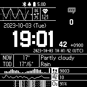

# Geektime

Geektime is a watchface for the Garmin Instinct 2.

## Motivation

I recently received the Garmin Instinct 2 as a gift, but couldn't find a watchface that I liked.  
So I decided to create one myself.

## Features

- Datetime
  - Local Datetime, with day of week and seconds
  - UTC Datetime, like: `2023-10-03 10:01:42 (UTC)`
- Status indicators
  - Notification, with count of unread notifications
  - Connection
  - Do not disturb
  - Battery
    - On charging, show battery percentage
    - Or, show remaining battery time
- Weathers
  - Current weather
    - Temperature
    - Weather condition
  - Today forecast
    - High and low temperature
    - Weather condition
- Graphs
  - Heart rate
    - Current heart rate
    - High and low heart rate in last 20 minutes
    - Line chart of heart rate in last 20 minutes
  - Steps
    - Current steps
    - Bar chart of delta of steps
  - Breath per minute
    - Current breath per minute
    - Line chart of breath per minute
  - Oxygen saturation
    - Current oxygen saturation
    - Heatmap chart of oxygen saturation

## Supported Languages

- English
- Korean(한국어)

## License

MIT